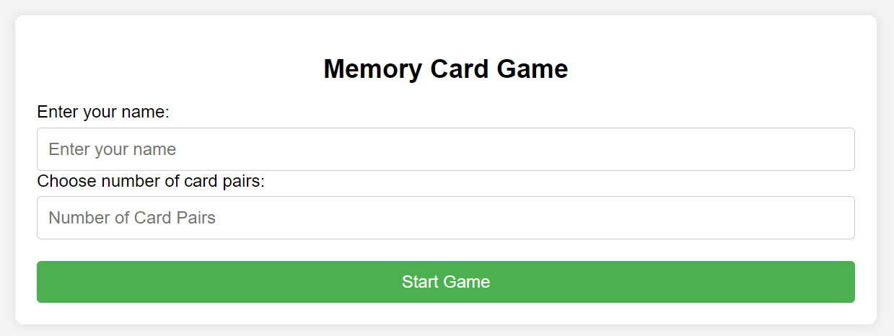
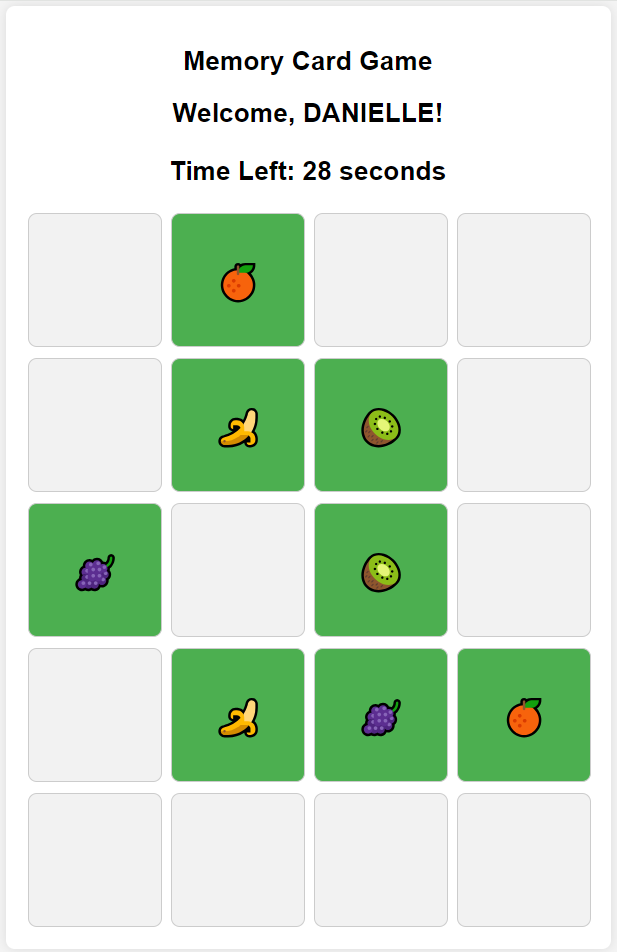
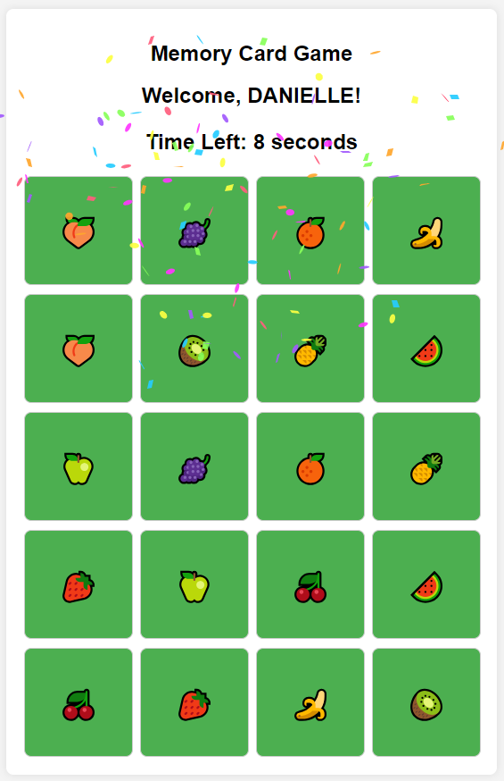
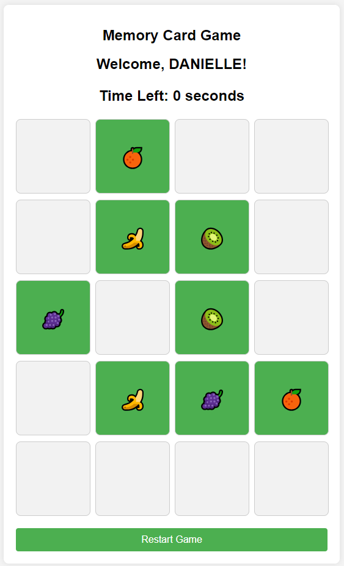

# Memory Card Game

## Overview
This is an implementation of a card memory game using JavaScript, HTML, and CSS. This simple web-based game challenges your memory as you match pairs of cards.

## Setup
To start the game, follow these steps:

1. Clone or download the repository.
2. After saving the project, ensure you have the following files:
   - `memory_game.html`
   - `styles.css`
   - `script.js`
3. Open the `memory_game.html` file in your preferred web browser (Chrome, Firefox, etc.).
4. Enter your name and choose the number of card pairs (between 2 and 10) you want to play with.
5. Click the "Start Game" button.

## How to Play
1. Once the game starts, you'll see a grid of face-down cards.
2. Click on any card to flip it over and reveal the image.
3. Click on a second card to find a match.
4. If the two cards match, they will stay face up; otherwise, they will flip back down.
5. The game is complete when all pairs are successfully matched under 60 seconds.

## Features
- **Customizable**: Choose the number of card pairs to play with.
- **Timer**: Race against the clock to win the game.
- **Responsive Design**: Play the game on various screen sizes.

## Screenshots
Here are some screenshots of the game in action:

### Main Menu

### Game Board

### Game Over Win

### Game Over Lose

## Usage Notes
- To restart the game after finishing, click the "Restart Game" button that appears when the game is over.

## Contribution
Feel free to fork the repository and submit a pull request with your improvements!

## Contact
For questions or feedback, visit my GitHub profile at [RoDanielle](https://github.com/RoDanielle).